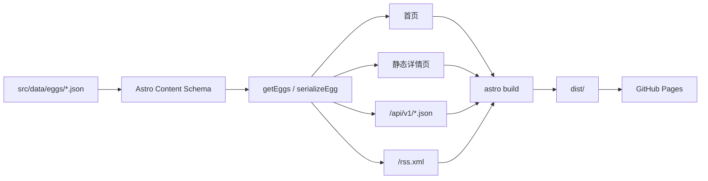
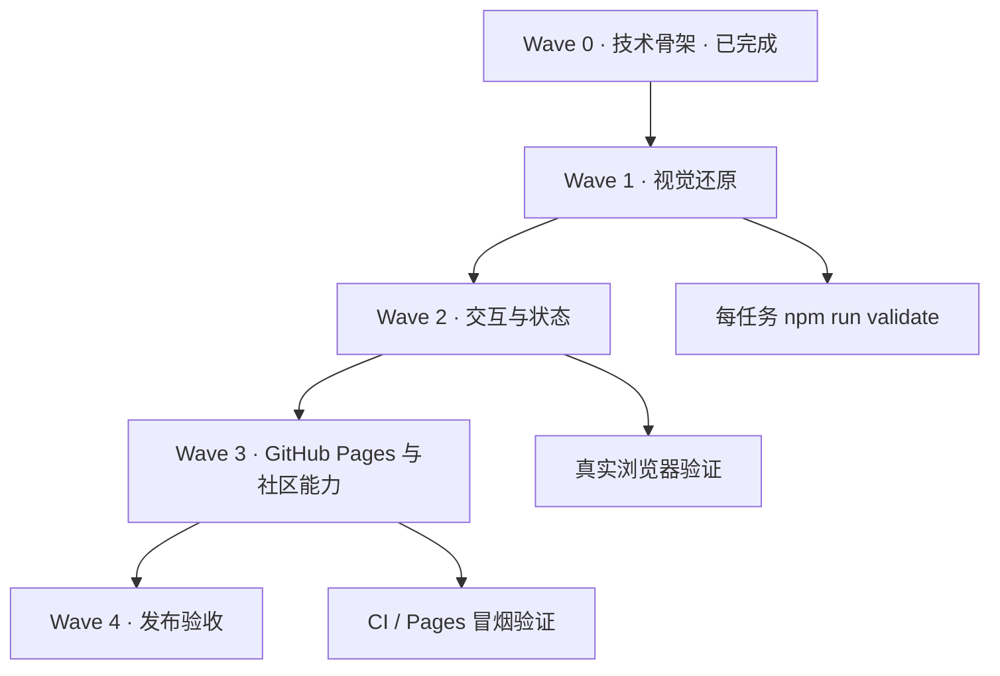
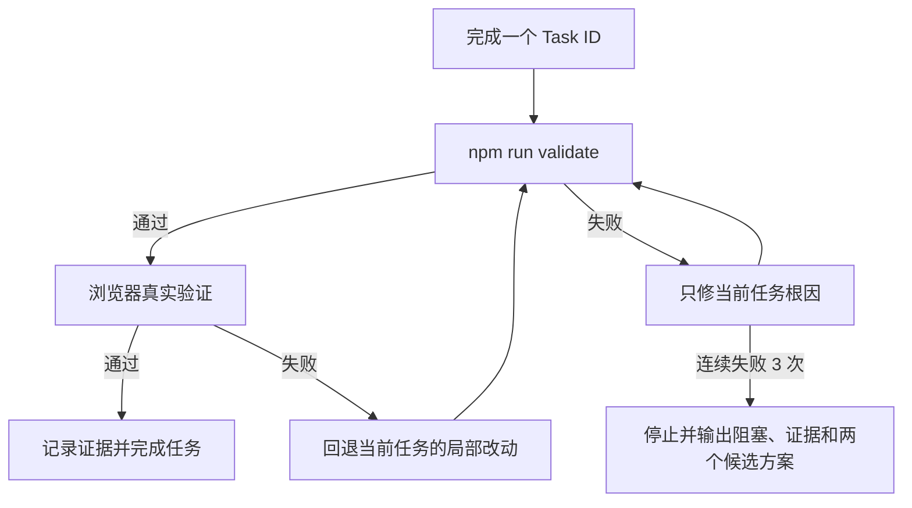

# cyber-eggs 可执行开发手册

状态：技术骨架已建立，视觉与真实业务尚未完成  
目标读者：后续接手任务的较小模型或人类开发者  
最后更新：2026-09-28

## 1. 项目启动信息

- **项目类型**：静态内容展示站
- **业务目标**：让访客立即理解“这里可以捡到 AI 时代的鸡蛋”，并浏览优惠卡片与详情
- **当前成功标准**：本地可启动、构建可通过、Demo 数据可生成首页/详情/API/RSS
- **技术栈**：Astro 7.3.5、TypeScript 6.0.3、原生 CSS、原生浏览器 JavaScript
- **终极功能**：访客可以发现、判断并订阅经过核验的 AI 免费额度
- **当前阶段边界**：展示站保持静态；真实数据收集通过同级独立服务 `../cyber-eggs-collector/` 进入候选和人工复核，不自动发布、不做订阅发送
- **默认循环轮次**：3
- **安全最大轮次**：6
- **每轮最大改动点数**：3

### In scope

- 首页、详情页、404
- 响应式 UI 与状态组件
- JSON 数据契约和构建时校验
- 静态 JSON API 与 RSS
- GitHub CI、Pages 发布骨架、贡献入口
- 可访问性、基础 SEO、浏览器验证

### Out of scope

- 真实优惠采集与发布
- 自动爬虫和 AI 核验
- 登录、收藏、管理后台
- 数据库和动态服务端 API
- 邮件、短信、浏览器推送
- React、Vue、Tailwind 和 UI 组件库

## 2. 当前可执行状态

| 能力 | 状态 | 入口 |
| --- | --- | --- |
| Astro 静态项目 | 已建立 | `package.json` |
| 数据 schema | 已建立 | `src/content.config.ts` |
| Demo 数据 | 已建立 | `src/data/eggs/*.json` |
| 数据访问层 | 已建立 | `src/lib/eggs.ts` |
| 首页 | 骨架完成 | `src/pages/index.astro` |
| 详情页 | 骨架完成 | `src/pages/eggs/[id].astro` |
| 404 | 骨架完成 | `src/pages/404.astro` |
| JSON API | 骨架完成 | `src/pages/api/v1/*.ts` |
| RSS | 骨架完成 | `src/pages/rss.xml.ts` |
| CI | 骨架完成 | `.github/workflows/ci.yml` |
| GitHub Pages 部署 | 未实现 | Task `GH-01` |
| 视觉精修 | 未实现 | Tasks `UI-01`–`UI-06` |
| 真实数据 | 已建立独立采集服务 | `../cyber-eggs-collector/README.md`；批准前不得进入 `src/data/eggs/` |

## 3. 真相源与阅读顺序

后续模型每次只加载当前任务需要的文件，按此顺序：

1. `AGENTS.md`：不可违反的工程边界。
2. 本文件中对应的 Task ID。
3. `docs/showcase-design.md`：产品、颜色、文案与页面结构。
4. 当前任务对应概念图：
   - 桌面首页：`docs/showcase-homepage-concept.png`
   - 详情页：`docs/ui/egg-detail-concept.png`
   - 移动端：首页 `docs/ui/mobile-home-concept.png`
   - 状态组件：`docs/ui/component-states-concept.png`
5. 当前任务将修改的源码文件。

不要一次加载所有图片和所有源文件。

## 4. 架构



模块依赖保持单向：

```text
data JSON → content schema → src/lib/eggs.ts → pages/components
styles → pages/components
pages/components 不得反向修改 data 或 schema
```

不增加 Service、Repository、Store、Context 等抽象层。出现第二个真实调用场景前，不抽象。

## 5. 本地命令

首次安装：

```bash
npm install
```

本地开发：

```bash
npm run dev
```

类型与 Astro 检查：

```bash
npm run check
```

静态构建：

```bash
npm run build
```

完整代码门禁：

```bash
npm run validate
```

依赖审计：

```bash
npm audit --audit-level=high
```

预览构建产物：

```bash
npm run preview -- --host 127.0.0.1
```

任何任务只有在 `npm run validate` 退出码为 0 后，才允许标记完成。

## 6. Wave 与任务依赖



### Wave 0：技术骨架

| ID | 状态 | 任务 | 验证 |
| --- | --- | --- | --- |
| `SKEL-01` | 完成 | Astro、TypeScript、npm lockfile | `npm run check` |
| `SKEL-02` | 完成 | schema、4 条 Demo 数据、数据访问层 | `npm run build` |
| `SKEL-03` | 完成 | 首页、详情、404、API、RSS | 构建路由清单 |
| `SKEL-04` | 完成 | CI、README、AGENTS、执行手册 | 文档回读 |

### Wave 1：视觉还原

#### `UI-01` 桌面首页

- **读取**：首页概念图、`src/pages/index.astro`、`src/styles/global.css`
- **修改范围**：只允许以上两个源码文件，必要时可修改现有组件
- **实现**：导航、Hero、三蛋货架、统计条、筛选、三列卡片、可信说明、页脚
- **验收**：1440px 宽度下层级与概念图一致；没有横向滚动；页面文字不是图片
- **验证**：`npm run validate` + 浏览器 1440×1000 截图

#### `UI-02` 鸡蛋卡片状态

- **读取**：状态概念图、`src/components/EggCard.astro`
- **实现**：鲜蛋、临期、待复核、臭蛋使用同一个组件，通过状态 class 改变
- **验收**：臭蛋无领取 CTA；临期有红色提醒；待复核不能伪装成可领取
- **验证**：首页四种 Demo 数据同时可见；键盘可聚焦详情链接

#### `UI-03` 详情页

- **读取**：详情概念图、`src/pages/eggs/[id].astro`
- **实现**：额度、条件、步骤、来源、核验时间、领取侧栏
- **验收**：未知条件显示“未知”，不能显示为“不需要”；Demo CTA 不跳真实页面
- **验证**：逐一打开 4 个 `/eggs/{id}/` 路由

### Wave 2：交互与响应式

#### `UI-04` 搜索、筛选与空状态

- **读取**：`src/pages/index.astro`
- **实现**：关键词、状态、类型组合筛选；无结果时显示空货架文案
- **验收**：筛选可以组合；清空后恢复所有卡片；无控制台错误
- **验证用例**：`Nova` 命中 1 条；`expired` 命中 1 条；不存在的词命中 0 条并显示空状态

#### `UI-05` 移动端

- **读取**：移动端概念图、`src/styles/global.css`
- **实现**：Hero 上下排列、三蛋同排、统计三列、筛选堆叠、卡片单列
- **验收**：390px 宽度无横向页面滚动；触控目标不小于 44px；正文无需缩放
- **验证**：390×844、768×1024、1440×1000 三档截图

#### `UI-06` 404 和交互状态

- **读取**：状态概念图、`src/pages/404.astro`
- **实现**：404、focus-visible、hover、disabled；Loading 仅在真实异步操作出现后添加
- **验收**：直接访问未知路径看到品牌化 404；键盘焦点清晰

### Wave 3：数据与 GitHub

#### `COLLECT-01` 候选数据收集链路

- **实现**：同级项目 `../cyber-eggs-collector/`；静态站不包含采集运行时代码
- **来源**：微信公众号搜索/正文、Linux.do feed/search/topic-content、RSS/Atom
- **处理**：规范化、URL 去重、Crawl4AI/OpenCLI 正文补全、证据评分、人工复核、批准后导出草稿
- **安全边界**：不覆盖 `src/data/eggs/`；公众号验证页、Linux.do 登录态、Browser Bridge 失败都保留为错误，不生成空候选
- **验收**：在采集服务目录运行 `python3 -m unittest discover -s tests -v`；实时运行前需连接 OpenCLI Browser Bridge，并人工核验官方领取页

#### `API-01` 静态接口契约

- **修改范围**：`src/pages/api/v1/*.ts`、`src/lib/eggs.ts`
- **实现**：保持 `version/generatedAt/demo/items`；破坏性字段变更必须创建 `/api/v2/`
- **验收**：`items.length` 与数据文件数一致；每项含 `id/provider/status/sourceUrl/demo`
- **验证**：执行“API 契约检查”命令

#### `RSS-01` Feed 语义

- **当前状态**：骨架把所有鸡蛋作为 RSS items
- **未来实现**：有真实更新事件后，RSS 改为发布“新增/变更/失效”事件，而不是每次重复全部清单
- **启动条件**：用户明确开始真实数据阶段

#### `GH-01` GitHub Pages 部署

- **前置输入**：真实 GitHub 仓库 URL、Pages 使用项目子路径还是自定义域名
- **实现**：增加官方 Pages workflow，设置 `SITE_URL` 与 `BASE_PATH`
- **验收**：PR 只运行 CI；`main` 构建并部署；线上首页、详情、API、RSS 可访问
- **回滚**：Pages 回退到上一个成功部署 artifact 或 Git commit

#### `GH-02` 社区入口

- **实现**：Issue Form 只先提供“界面问题”和“功能建议”；真实鸡蛋投稿表单继续暂停
- **验收**：README、站点和模板术语一致；不要求用户在多个地方重复填写信息

#### `GH-03` 社交预览

- **实现**：按现有品牌生成 1280×640 社交图，上传到 GitHub 仓库设置
- **验收**：Logo、主标语和项目名在缩略图尺寸仍可读

## 7. 验证要点清单

### 7.1 构建门禁

- [ ] `npm ci` 可以从空 `node_modules` 恢复项目
- [ ] `npm run check` 为 0 errors、0 warnings、0 hints
- [ ] `npm run build` 成功生成所有静态路由
- [ ] `npm audit --audit-level=high` 无 high/critical 漏洞
- [ ] `dist/` 未被提交

### 7.2 数据门禁

- [ ] 每枚鸡蛋独立一个 JSON 文件
- [ ] 文件通过 `src/content.config.ts` 校验
- [ ] Demo 厂商是虚构名称
- [ ] Demo 链接使用 `example.com`
- [ ] Demo 数据包含 `"demo": true`
- [ ] `null` 表示未知，禁止把未知转换为 `false`
- [ ] 过期卡片没有可用领取按钮

API 契约检查：

```bash
node -e "const f=require('fs');const d=JSON.parse(f.readFileSync('dist/api/v1/eggs.json','utf8'));if(d.version!=='1'||!d.demo||d.items.length!==4)process.exit(1);console.log('API contract OK:',d.items.length)"
```

Demo 安全扫描：

```bash
rg -L '"demo": true' src/data/eggs/*.json
rg -L 'https://example.com/' src/data/eggs/*.json
```

两个命令都应无输出。

### 7.3 路由门禁

- [ ] `/` 返回 200
- [ ] `/eggs/nova-cloud/` 返回 200
- [ ] `/api/v1/eggs.json` 返回合法 JSON
- [ ] `/api/v1/meta.json` 返回 count 与 statuses
- [ ] `/rss.xml` 返回 XML
- [ ] 未知路径进入 404 页面
- [ ] 配置 `BASE_PATH=/cyber-eggs` 后内部链接仍正确

### 7.4 交互门禁

- [ ] 搜索大小写不敏感
- [ ] 状态与类型筛选可以组合
- [ ] 无结果时空状态出现
- [ ] 键盘 Tab 顺序符合视觉顺序
- [ ] `focus-visible` 清晰可见
- [ ] 禁用 CTA 不可点击
- [ ] 浏览器控制台无错误

### 7.5 响应式门禁

| 视口 | 必验内容 |
| --- | --- |
| 390×844 | 无横向滚动、按钮可触控、卡片单列 |
| 768×1024 | 货架完整、筛选不溢出、详情侧栏正确下沉 |
| 1440×1000 | 三列卡片、Hero 双栏、详情侧栏固定 |

### 7.6 可访问性门禁

- [ ] 页面只有一个主 `h1`
- [ ] 标题层级连续
- [ ] Logo 有可访问名称，装饰图使用空 `alt`
- [ ] 表单控件有 label
- [ ] 状态不只依赖颜色，还包含文字
- [ ] `prefers-reduced-motion` 下无持续动画
- [ ] 文字与背景对比足够
- [ ] 200% 缩放仍能操作

### 7.7 内容与信任门禁

- [ ] 任何真实优惠都有官方来源、领取条件和核验日期
- [ ] 当前阶段不得加入真实优惠
- [ ] 页面明确显示 Demo 标签
- [ ] 不出现多账号、绕限制、伪造身份等内容
- [ ] 返利链接默认禁止

## 8. 失败与回退



- 不使用 `git reset --hard` 或覆盖用户改动。
- 失败只回退当前 Task ID 的局部修改。
- 依赖安装失败时不换包管理器；先检查 Node/npm 和网络。
- schema 变更导致旧数据失败时，不放宽校验掩盖问题；修数据或明确版本迁移。
- Pages 部署失败不得影响本地构建与 CI。

## 9. 小模型任务模板

每次只复制一个 Task ID，并使用以下提示：

```text
执行 cyber-eggs 的 Task <ID>。

先阅读：
1. AGENTS.md
2. docs/IMPLEMENTATION_PLAYBOOK.md 中 Task <ID>
3. Task 指定的概念图与源码文件

边界：只修改 Task 列出的文件；不要新增依赖；不要加入真实优惠。
完成条件：运行 npm run validate，并按 Task 验收项做真实浏览器验证。
输出：修改文件、验证命令与结果、未验证项。不要创建 commit，除非我明确要求。
```

如果任务超过 3 个修改点，拆成下一层 Task，不要一次完成整站。

## 10. 完成定义

展示站阶段只有同时满足以下条件才算完成：

- [ ] `UI-01`–`UI-06` 全部通过
- [ ] `API-01` 通过
- [ ] `GH-01`–`GH-03` 通过
- [ ] 完整验证命令通过
- [ ] 三档响应式截图完成
- [ ] 键盘与 reduced-motion 验证完成
- [ ] 线上 GitHub Pages 冒烟测试通过
- [ ] README 与实际功能一致
- [ ] 未验证项和已知限制已披露

自动发布、AI 核验和订阅系统仍是下一阶段，不计入当前完成定义；独立采集服务只负责候选、证据和人工批准前的草稿。

## 11. 当前实测证据

| 日期 | Task | 命令 | 结果 |
| --- | --- | --- | --- |
| 2026-09-28 | `SKEL-01` | `npm install` | 安装 271 packages，0 vulnerabilities |
| 2026-09-28 | `SKEL-01` | `npm run check` | 0 errors、0 warnings、0 hints |
| 2026-09-28 | `SKEL-02/03` | `npm run build` | 首页、404、4 个详情、2 个 JSON、RSS 构建成功 |
| 2026-09-28 | `SKEL-02` | API 契约与 Demo 安全断言 | 4 条数据，契约与 `.example` URL 检查通过 |
| 2026-09-28 | `SKEL-03` | `xmllint --noout dist/rss.xml` | RSS XML 合法 |
| 2026-09-28 | `SKEL-03` | Preview + `curl` | 首页、详情、API、RSS 为 200；未知路径为 404 |
| 2026-09-28 | `UI-04` 骨架 | 真实浏览器搜索 | `Nova` 命中 1 条；无结果状态可见 |
| 2026-09-28 | `UI-05` 骨架 | 390×844 浏览器视口 | `innerWidth=390`，无横向溢出，控制台无错误 |
| 2026-09-28 | `UI-01` | `npm run validate` + Chrome 1440×1000 截图 | 0 errors/warnings/hints；层级与概念图一致；scrollWidth 无横向溢出；控制台无错误 |
| 2026-09-28 | `UI-02` | `npm run validate` + Chrome 1440 卡片截图 | 四状态同组件渲染；臭蛋为“查看历史”无领取 CTA；临期红字+“剩 3 天”印章；待复核为描边“查看蛋源”；详情链接均可聚焦；控制台无错误 |
| 2026-09-28 | `UI-03` | `npm run validate` + 逐一打开 4 个 `/eggs/{id}/` | 0 errors/warnings/hints；KYC `null` 显示“未知”；Demo 主按钮 `aria-disabled` 不跳真实页面；灰蛋/价签划线/“已到期”状态正确；控制台无错误 |
| 2026-09-28 | `UI-04` | Chrome 交互测试 | `Nova`=1、`expired`=1、`novacloud`（小写）=1、不存在词=0 且空状态可见、清空后恢复 4 条、fresh+signup 组合=1；控制台无错误 |
| 2026-09-28 | `UI-05` | `npm run validate` + 真实浏览器 390×844 / 768×1024 / 1440×1000 截图 | 0 errors/warnings/hints；三档均 `scrollWidth === innerWidth` 无横向滚动；390px：Hero 上下排列、三蛋同排、统计三列、筛选堆叠、卡片单列、CTA 全宽；768px：货架完整、筛选单行、卡片两列、详情侧栏下沉；1440px：Hero 双栏、三列卡片；GitHub 按钮实测 45px、筛选控件 48px 满足 44px 触控目标；页面控制台无错误（仅浏览器扩展自身的 `chrome-extension://invalid/` 报错） |
| 2026-09-28 | `UI-06` | `npm run validate` + 浏览器访问 `/no-such-egg/`、Tab 与 hover 实测 | 0 errors/warnings/hints；未知路径返回 404 品牌化页面（大 404 + 双按钮 + 悬挂价签鸡蛋视觉）；390px 单列堆叠、按钮全宽；Tab 命中链接显示 `rgb(120,255,144)` 3px focus-visible；卡片 hover `translateY(-3px)` + 边框变色；`aria-disabled` CTA `pointer-events:none` + opacity 0.65；补 `favicon.ico` 消除控制台 404 噪音 |
| 2026-09-28 | `API-01` | 构建后 `node` 契约检查 + Demo 安全扫描 + `xmllint` | `eggs.json`：version=1、demo=true、items=4（与数据文件数一致）；每项含 id/provider/status/sourceUrl/demo；`meta.json` 返回 count=4 与 statuses `{fresh:1,expiring:1,stale:1,expired:1}`；4 个 JSON 均含 `"demo": true` 与 `.example` URL；RSS XML 合法 |
| 2026-09-28 | `GH-01` | 创建 `xiangmingAI/cyber-eggs` 公开仓库；`gh api .../pages build_type=workflow`；推送 `.github/workflows/deploy.yml` 后 `gh run watch` | 仓库 https://github.com/xiangmingai/cyber-eggs；本地 `BASE_PATH=/cyber-eggs` 构建内部链接全部带前缀；Actions 上 build(24s)+deploy(24s) 成功；线上 `/`、`/eggs/nova-cloud/`、`/api/v1/eggs.json`、`/api/v1/meta.json`、`/rss.xml` 均为 200，`/nope/` 返回品牌化 404；线上首页截图渲染正常，GitHub 按钮指向真实仓库 |
| 2026-09-28 | `GH-02` | 新增 `.github/ISSUE_TEMPLATE/`（config + ui-issue + feature-suggestion），开启 Discussions，更新 README 与详情页报告链接 | CI 与 Deploy 均成功；`/issues/new/choose` 302 到登录/选择页正常；线上详情页"报告臭蛋"指向 issues/new/choose；术语统一为界面问题/功能建议/Discussions，鸡蛋投稿表单保持暂停 |
| 2026-09-28 | `GH-03` | 无头 Chrome 截取 1280×640 品牌图 → `.github/social-preview.png`；仓库 Settings 上传 Social preview | 缩略图尺寸下 Logo、项目名、主标语均可读；设置页已显示预览；另存 `public/social-preview.png` 并在 BaseLayout 输出 `og:image`（线上指向 `/cyber-eggs/social-preview.png`） |
| 2026-09-29 | `COLLECT-01` | 独立服务 `python3 -m unittest discover -s tests -v`；`opencli list -f yaml`；`opencli linux-do -h`；`opencli weixin -h` | 采集服务测试通过；确认 Linux.do 与微信公众号命令契约；实时探测因 OpenCLI Browser Bridge 未连接失败，已作为可重试错误保留，未发布任何真实数据 |

后续模型必须在完成任务后向本表追加一行真实证据；不得填写未执行的命令。
